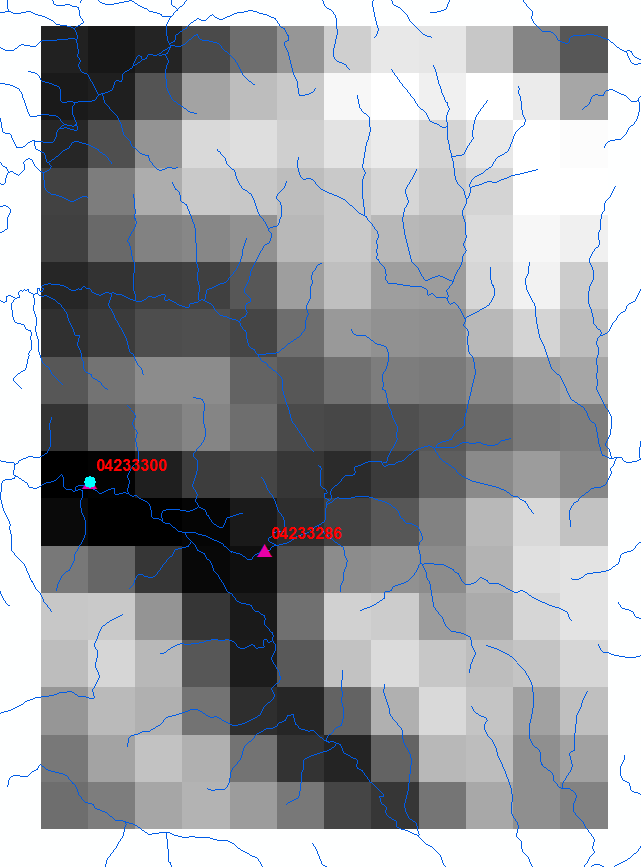

<style>
p.caption {
  font-size: 0.8em;
  color: Grey; 
}
.figure {
  border-radius: 5px;
  padding: 20px
}

</style>
```{r setup, include=FALSE}
library(knitr)
knitr::opts_chunk$set(echo = FALSE, message = FALSE, warning = FALSE, comment=NA)
#Determine the output format of the document
outputFormat   = opts_knit$get("rmarkdown.pandoc.to")
#Figure and Table Caption Numbering, for HTML do it manually
capTabNo = 1; capFigNo = 1;
#Function to add the Figure Number
CapFig = function(x){
  if(outputFormat == 'html'){
    x = paste0("Figure ",capFigNo,". ",x)
    capFigNo <<- capFigNo + 1
  }; x
}
```

# Purpose of this vignette


# Background

## NWM Nudging 
NWM nudging.
Why Nudging?
Nudging equation. 
Issues with nudging?


## Channel-only
Currently the channel-model of the NWM is 1-way coupled to the upstream model components, it only recieves inflow. Therefore the channel can be run in a stand-alone mode. This is what we call "channel-only". The channel-only mode has 2 options: 

  * Channel (including nudging) + lakes
  * Channel + lakes + ground water buckets

NWM v1.2 operational `channel_rt` output contains the forcing fields for running the NWM in channel-only mode. We have not really run this in small basins to date and are still refining the NWM subset scripts necessary to do this. Restart files are also necessary.


# Setup and Conventions
This vignette comes in several versions which may mix R and bash codes. One version emphasizes running the model and only a few evaluation codes. A second version contains all the code to reproduce this vignette and has detailed R codes. Please note 

* `>` is the R prompt
* `$` is the bash prompt. 

The following code sets our working directories. 

```{r, include=FALSE}
options(warn=1)
library(knitr)
opts_chunk$set(prompt=TRUE)
#https://stackoverflow.com/questions/39023509/changing-the-prompt-in-a-multilanguage-knitr-rmarkdown-document
knit_hooks$set(
  prompt = function(before, options, envir) {
    options(prompt = if (options$engine %in% c('sh','bash')) '$ ' else '> ')
})

```

```{r, eval = TRUE, message=FALSE}
# All the packages which will be used below
library(rwrfhydro)
library(dataRetrieval)
library(ggplot2)
library(data.table)
library(plyr)
library(data.table)
library(plotly)

topDir <- '~/wrfHydroTestCases/04233300/'
setwd(topDir)
```

```{r, include=FALSE}
opts_knit$set(root.dir = topDir)
```

We are using the `bash` shell.

```{r, engine='bash', eval = TRUE, echo=TRUE}
topDir=~/wrfHydroTestCases/04233300
```
```{r, engine='bash', eval = TRUE, echo=TRUE}
cd $topDir
```


#Experimental Design

To demonstrate the channel-only mode of the NWM and the streamflow nudging capabilites, we'll run three experiments:

1. *Full-model run*.
2. *Channel-only run*: forced with channel outputs from full-model run in 1.
3. *Channel-only run with assimilation*: as in 2 but incorporating observations in the interior of the basin. 

In all cases, we'll evaluate the streamflow simulation at the outlet of the basin against 

* USGS streamflow observations.

```{r, eval = TRUE}
# Set the colors now for all the runs we will perform.
#http://www.stat.columbia.edu/~tzheng/files/Rcolor.pdf
obsModAssimColors <- c(observed='black', modeled='royalblue3', assim='tomato3')
```

## Overview of directories.
```{r, engine='bash', eval=FALSE, echo=TRUE}
ls -d *
```


```
# Model table paramters
CHANPARM.TBL
GENPARM.TBL
HYDRO.TBL
LAKEPARM.TBL
MPTABLE.TBL
SOILPARM.TBL
URBPARM.TBL
VEGPARM.TBL

# Model DOMAIN files
DOMAIN/

# Model forcing directory
FORCING/

# Model restart files from long-term spinup
restart/

# Streamflow observations for nudging assimilation
nudgingTimeSliceObs/

# Script to bring binaries to run directories on the virtual machine.
linkBinary.sh

# Model namelists for the 3 experiments
namelist.hrldas.201306-201309                          ## full-model
namelist.hrldas.201306-201309.channelOnly              ## channel-only w&w/o assimilation
hydro.namelist.201306-201309                           ## full-model
hydro.namelist.201306-201309.channelOnly               ## channel-only (w/o assimilation)
hydro.namelist.201306-201309.channelOnly.assimUpstream ## channel-only w/ assimilation

# Run directories for the 3 experiments
run.201306-201309.fullModel/                           ## full-model run
run.201306-201309.channelOnly/                         ## channel-only run
run.201306-201309.channelOnly.assimUpstream/           ## channel-only run w/ assimilation
```

## Domain
The domain used in this demonstration is a "cut-out" of the v1.2 NWM full domain above the streamflow gage identified by the USGS as 04233300. This is why the top-leve directory will be called 04233300 below. This domain was selected because it is a small basin with "nested gages". A view of these nested gages, topography, and channel network for the the cut-out was provided by ArcGIS. 

```{r, outheight='50%', echo=FALSE, fig.align="center", fig.cap=CapFig("The 04233300/DOMAIN/geo_em.nc HGT_M (elevation) field where high is white and low is black. Overlain with the NHD+based streamflow network and the nested gages used in the model experiments.")}

```

We see the 04233286 gage is above the 04233300, so that flow at the upper gage is part of the flow observed at the lower gage. We will reveal the names of these gages shortly. Note that there are stream reaches within the rectangular model domain which are in other basins. These are only included because the 2D model needs run on a rectangular domain. 

For now, let's get a better view of where this domain is located in the USA using some simple tools in rwrfhydro. First we'll look at the `Fulldom.nc`.

```{r, eval = TRUE, fig.align="center", out.width='100%', fig.cap=CapFig('The location of the 04233300 domain in the US.')}
fullDomFile <- 'DOMAIN/Fulldom.nc'
# The function returns a function which we will call with some basic plotting options.
VisFullDom <- rwrfhydro::VisualizeDomain(fullDomFile, plotVar='TOPOGRAPHY', plot=FALSE)
# Call the function with several options.
VisFullDom(zoom=7,  alpha=1, maptype='roadmap', gradNColors='red3', pointsize=.1 )
```

Let's take a closer look at the local Ithaca area and switch to the terrain map.
```{r, eval = TRUE, fig.align="center", out.width='100%', fig.cap=CapFig('The 04233300 domain near Ithaca, NY. Elevation is shown in meters over google terrain map.'), fig.height=5, fig.width=8}
# The returned function itself returns data so that it can be worked with in detail.
gg_fullDom <- VisFullDom(zoom=11, alpha=.1, maptype='terrain', plot=FALSE)
gg_fullDom[[2]] + scale_color_gradientn(name='TOPOGRAPHY (m)', colours=c("red", "green", "blue"))
```

The `RouteLink.nc` file defines the streamflow network. Another function helps visualize this file. 
```{r, eval = TRUE, fig.align="center", out.width='100%', fig.cap=CapFig('The 04233300 flowlines (endpoints connected with line segments, not shapefile flowlines).'), fig.height=5, fig.width=8}
# Similarly with VisualizeDomain, VisualizeRouteLink returns a function which in turn returns data.
VisRouteLink <- VisualizeRouteLink(file = 'DOMAIN/RouteLink.nc') 
gg_routeLink <- VisRouteLink(zoom=11, plotType='terrain', doPlot=FALSE, padPlot=.3)
gg_routeLink[[2]] + coord_equal() 
```

Note that we simply draw lines between end-points of the river reaches, so this is a crude representation of the shapefile flowlines rendered by ArcGIS above but it's fairly cheap to run. (Note that for large domains, this function may take some time and can be dramatically spedup by a precomputed connectivity data file.)

The above plots can be fairly easily combined (if you know what you're doing), which illustrates the flexibilty of the functions and data returned from the original functions we called. 
```{r, eval = TRUE, fig.align="center", out.width='100%', out.height='30%', fig.cap=CapFig('The 04233300 flowlines (endpoints) overlain on the Fulldom.nc TOPOGRAPHY.'), fig.height=5, fig.width=8}
gg_fullDom[[2]] + 
  geom_segment(data = gg_routeLink[[1]],
               aes(x = lon, y = lat, xend = to_lon, yend = to_lat), 
               color='blue') +
  scale_color_gradientn(name='TOPOGRAPHY (m)', colours=c("red", "green", "blue"))
```

## Streamflow observations
Get the instantaeous observations from NWIS using the `dataRetrieval` package.
```{r, eval = FALSE}
siteNumber <- c("04233300", "04233286")
parameterCd <- "00060"  # Discharge
startDate <- "2013-06-01"
endDate <- "2013-10-01"
obsDischarge <- dataRetrieval::readNWISuv(siteNumber, parameterCd, startDate, endDate)
obsDischarge <- as.data.table(obsDischarge)
cfsToCms <- 1/35.31466621266132
obsDischarge[, `:=`(discharge.cms=X_00060_00000*cfsToCms)]
```

```{r, include=FALSE}
#save(obsDischarge, file='~/WRF_Hydro/NWC_training/channel-only_nudging.obs.Rdata')
load('~/WRF_Hydro/NWC_training/channel-only_nudging.obs.Rdata')
```

Plot the instantaneous observed data.

```{r, eval = TRUE, fig.align="center", out.width='100%', fig.cap=CapFig('Observed discharge at upstream (04233286) and downstream (04233300) gages pulled from USGS NWIS.')}
SiteLabeller <- function(site) {
  labels <- paste0(attributes(obsDischarge)$siteInfo$station_nm, 
                  ' (',attributes(obsDischarge)$siteInfo$site_no,')')
  names(labels) <- attributes(obsDischarge)$siteInfo$site_no
  labels[site]
}

ggplot(obsDischarge) +
  geom_point(aes(dateTime, discharge.cms, color='observed'), size=.7) +
  theme_bw(base_size=16) +
  facet_wrap(~site_no, ncol=1, 
             labeller=labeller(site_no=SiteLabeller)) +
  scale_y_continuous(name='Discharge (cms)') +
  scale_x_datetime(name='2013') + 
  scale_color_manual(name='', values=obsModAssimColors) 
```


# Compile NWM (with nudging)
Change directories (cd) to the model code directory. 

```{r, engine='bash', eval=FALSE, echo=TRUE}
cd ~/wrf_hydro_nwm/trunk/NDHMS
```

There are several ways to set the environment variables which determine the compile-time options for the model. Here we will set the variables in `setEnvar.sh` file (which is sourced when you run `compile_offline_NoahMP.sh`) to what is shown below.

```{r, engine='bash', eval=FALSE, echo=TRUE}
cat setEnvar.sh 
```

```
#!/bin/bash

### This will called by either compile_offline_NoahMP.csh
### or compile_offline_Noah.csh

### turn on WRF_HYDRO for NoahMP
export WRF_HYDRO=1

### turn on output information during running time.
export HYDRO_D=0

### turn on distributed parameters for NoahMP
export SPATIAL_SOIL=1  

### turn on RAPID model
export WRF_HYDRO_RAPID=0

### using large netcdf file definition.
export WRFIO_NCD_LARGE_FILE_SUPPORT=1

### running in REALTIME mode (with reduced output).
export HYDRO_REALTIME=1

### turn on wcoss flag 
export NCEP_WCOSS=1

### turn nudging off
export WRF_HYDRO_NUDGING=1
```

Then run the configure script 

```{r, engine='bash', eval=FALSE, echo=TRUE}
./configure 6
```

and compile the model with NoahMP

```{r, engine='bash', eval=FALSE, echo=TRUE}
./compile_offline_NoahMP.sh
```

# Full Model Run
## Setup 
Return to the `$topDir` to examine the setup for the full-model simulation.

```{r, engine='bash', eval=TRUE, echo=TRUE}
cd $topDir
```

Forcing data for this run is in `FORCING/`, as specified by
```{r, engine = 'bash', eval = TRUE, echo=TRUE}
grep INDIR namelist.hrldas.201306-201309
```

These forcing files are the standard `LDASIN` files in hour format. For example,

```{r, engine = 'bash', eval = TRUE, echo=TRUE}
ls FORCING/ | head
```

And this forcing format is specfied by the `namelist.hrldas` option `FORC_TYP=1`. In our experiments we will be using two different forcing types as revealed by a quick `grep`:

```{r, engine = 'bash', eval = TRUE, echo=TRUE}
grep FORC_TYP namelist.hrldas.201306-201309* 
```

In the channel-only runs we have `FORC_TYP=9` and this means that fluxes contained in the `CHRTOUT`  files are used to drive the channel-only model run. To do this we need to output the necessary channel-only forcing/flux variables to the files. For `FORC_TYP=9` we need the following in the hydro.namelist:

```{r, engine = 'bash', echo=TRUE, eval=TRUE}
grep -A5 '! Options to output channel' hydro.namelist.201306-201309
```

Here we are not running the bucket model. If we also wanted to run the bucket model as part of the channel-only run then we would need `output_channelBucket_influx = 1` in this full-model run and `FORC_TYP=10` in the channel-only run in the next section.

## Caveates of outputting channel-fluxes... 


## Run
Change the working directory (cd) to the full-model run directory, 

```{r, engine = 'bash', eval=FALSE, echo=TRUE}
cd run.201306-201309.fullModel/
```
```{r, include=FALSE}
opts_knit$set(root.dir = paste0(topDir,"/run.201306-201309.fullModel"))
```

Here all the setup from `$topDir` are linked
```{r, engine='bash', eval=TRUE, echo=TRUE}
ls -ld namelist.hrldas hydro.namelist FORCING
```

Bring over the model binary.
```{r, engine='bash', eval=FALSE, echo=TRUE}
ln -sf ~/wrf_hydro_nwm/trunk/NDHMS/Run/wrf_hydro.exe .
```

Launch the run.
```{r, engine = 'bash', eval = FALSE, echo=TRUE}
mpiexec -n 1 ./wrf_hydro.nudging.exe
```

## Analysis
```{r, eval=TRUE}
## Set the path to the current run.
fullModelDir <- paste0(topDir,"/run.201306-201309.fullModel")
setwd(fullModelDir)
```

```{r, include=FALSE}
opts_knit$set(root.dir = fullModelDir)
```

```{r, eval=TRUE}
# Identify the links with gages and a mapping between them using a named vector.
# Which points have gages?
rl <- GetNcdfFile('DOMAIN/RouteLink.nc', q=TRUE,
                  var='time', exclude=TRUE)
theLinks <- rl$link[which(trimws(rl$gages) != '')]
theGages <- rl$gages[which(trimws(rl$gages) != '')]
link2gage <- theGages
names(link2gage) <- theLinks
```

We'll be getting three different model runs, so let's express this as a function (DRY principle).
```{r, eval=TRUE}
GetAllChrtout <- function(path, runId) {
  # Identify the files
  modelChrtoutFiles <- list.files(path=path, pattern='CHRTOUT', full.names=TRUE)
  # Get the data using plyr. This can easily be parallelized on most systems but not shown here.
  modelData <-  
    plyr::ldply(rwrfhydro::NamedList(modelChrtoutFiles),
                rwrfhydro::GetNcdfFile, variables=c('time'), exclude=TRUE, quiet=TRUE)
  # Work with it as a data.table.
  modelData <- data.table::as.data.table(modelData)
  # Calculate the times using POSIXct
  modelData[, `:=`(POSIXct=as.POSIXct(basename(.id), format='%Y%m%d%H', tz='UTC'))]
  # Change the name streamflow to something a bit more specific to the run.
  setnames(modelData, 'streamflow', runId)
  # Return is the last expression
  modelData
}
```

```{r, eval=FALSE}
fullModelData <- GetAllChrtout(path='.', runId='modeled')
```

```{r, include=FALSE}
#save(fullModelData, file='~/WRF_Hydro/NWC_training/channel-only_nudging.fullModel.Rdata')
load('~/WRF_Hydro/NWC_training/channel-only_nudging.fullModel.Rdata')
```

Subset the full streamflow to just the gages. We didnt do this when we read it in so that we could compare the full streamflow against the channel-only run later.

```{r, eval=TRUE, out.width='100%', fig.cap=CapFig('Full-model run (open loop) comparison to observations at upstream (04233286) and downstream (04233300) gages.')}
fullModelData.gages <- fullModelData[ station_id %in% theLinks, ]
fullModelData.gages$site_no <-
    trimws(link2gage[as.character(fullModelData.gages$station_id)])

setnames(obsDischarge, 'discharge.cms', 'observed')

obsModPlot <- merge(fullModelData.gages, obsDischarge, 
                    by.x=c("site_no", "POSIXct"), 
                    by.y=c("site_no", "dateTime") )
obsModPlot.m <- melt(obsModPlot, id.vars = c("site_no", "POSIXct"), 
                     measure.vars = c('observed','modeled'), 
                     variable.name = 'obsMod', 
                     value.name = 'Discharge (cms)')

ggplot(obsModPlot.m) +
  geom_point(aes(x=POSIXct, y=`Discharge (cms)`, color=obsMod), size=.5) + 
  facet_wrap(~site_no, ncol=1, 
             labeller=labeller(site_no=SiteLabeller)) +
  scale_y_continuous(trans='log') +
  scale_x_datetime(name='2013') + 
  scale_color_manual(name='', values=obsModAssimColors) +
  theme_bw(base_size=13)
```

# Channel-Only Run
## Setup
We'll now move back to the top-level directory. To examine the setup for the channel-only run.
```{r, engine = 'bash', eval=TRUE, echo=TRUE}
cd $topDir
```
```{r, include=FALSE}
opts_knit$set(root.dir = topDir)
```

```{r, include=FALSE}
opts_knit$set(root.dir = topDir)
```

For the channel-only run, The "`CHRTOUT`" files from the full model run above become the forcing files.

```{r, engine = 'bash', eval = TRUE, echo=TRUE}
grep INDIR namelist.hrldas.201306-201309.channelOnly
```

Note that I've symlinked the full-model run directory into the channel-only run directory.
```{r, engine = 'bash', eval = TRUE, echo=TRUE}
ls -l run.201306-201309.channelOnly/run.201306-201309.fullModel
```

```{r, engine = 'bash', eval = TRUE, echo=TRUE}
ls -l run.201306-201309.channelOnly/run.201306-201309.fullModel/20130601*CHRTOUT* | head
```

Let's take a look at the contents of the files. Since some (windows) systems may not have the command line `ncdump` utility, we'll take a look using `rwrfhydro::ncdump`.

```{r, eval = TRUE, echo=TRUE}
ncdump('run.201306-201309.channelOnly/run.201306-201309.fullModel/201306010100.CHRTOUT_DOMAIN1')
```

The last two variables in the file, `qSfcLatRunoff` and `qBucket`, are the forcing fluxes for the channel-only run. The flux from the overland run off and subsurface exfiltration are collected in `qSfcLatRunoff`. The discharge from the bucket to the channel is in `qBucket`. The options also exists to get the fluxe to the bucket and run the bucket model with the channel, but we'll not look at that in detail here.

As we previewed previously, channel-only runs change the `FORC_TYPE` in the `namelist.hrldas` to 9 (10 would include the bucket with the model).

```{r, engine = 'bash', eval = TRUE, echo=TRUE}
grep FORC_TYP namelist.hrldas.201306-201309* 
```

In configuring the namelist, we can set `output_channelBucket_influx = 1`, though these outputs will be redundant with the fields in the files used to force the model.

## Run
```{r, engine = 'bash', eval=FALSE, echo=TRUE}
cd run.201306-201309.channelOnly/
```
```{r, include=FALSE}
opts_knit$set(root.dir = paste0(topDir,"/run.201306-201309.channelOnly"))
```

Here all the setup from `$topDir` are linked, just check the namelists are what we are expecting.
```{r, engine='bash', eval=TRUE, echo=TRUE}
ls -ld namelist.hrldas hydro.namelist
```

Bring over the model binary.
```{r, engine='bash', eval=FALSE}
ln -sf ~/wrf_hydro_nwm/trunk/NDHMS/Run/wrf_hydro.exe .
```

```{r, engine = 'bash', eval = FALSE, echo=TRUE}
mpiexec -n 1 ./wrf_hydro.nudging.exe
```

## Analysis

```{r, eval=TRUE}
## Set the path to the current run.
chanOnlyDir <- paste0(topDir,"/run.201306-201309.channelOnly")
setwd(chanOnlyDir)
```

```{r, include=FALSE}
opts_knit$set(root.dir = chanOnlyDir)
```

```{r, eval=FALSE}
chanOnlyData <- GetAllChrtout(path='.', runId='channelOnly')
```

```{r, include=FALSE}
#save(chanOnlyData, file='~/WRF_Hydro/NWC_training/channel-only_nudging.chanOnly.Rdata')
load('~/WRF_Hydro/NWC_training/channel-only_nudging.chanOnly.Rdata')
```

The channel-only simulation matches exactly over all streamflow reaches and all times except that the forcing field `qSfcLatRunoff` is not exactly replicated in the output file. 

```{r, eval=TRUE}
for(vv in names(chanOnlyData)) print(paste(vv,':',identical(fullModelData[[vv]], chanOnlyData[[vv]])))
vv='qSfcLatRunoff'
print(vv)
print(summary(fullModelData[[vv]]-chanOnlyData[[vv]]))
```


There really is not point in plotting the flows from this run as they are identical to the flows plotted for the full-model run. This section was intended to show how to setup a channel run from a full-model run and demonstrate that the two are identical for channel-states. 

# Channel-Only Run with Nudging Data Assimilation
Edit the Routelink file to only assimilate the upstream gage. Set the `gages` variable to `''` for the down stream gage.


```{r, eval=TRUE}
## Set the path to the current run.
chanOnlyAssimDir <- paste0(topDir,"/run.201306-201309.channelOnly.assimUpstream")
setwd(chanOnlyAssimDir)
```

```{r, include=FALSE}
opts_knit$set(root.dir = chanOnlyAssimDir)
```

```{r, eval=TRUE}
rlFileIn <- '../DOMAIN/RouteLink.nc'
rl <- as.data.table(GetNcdfFile(rlFileIn, q=TRUE))
# Censor the downstream gage
whDownstream <- which(trimws(rl$gages)=='04233300')
rl$gages[whDownstream] <- formatC('', width=15)
```

```{r, eval=FALSE}
rlFileOut <- AddRouteLinkGage(rlFileIn, rl$gages, rl$link, 'assimUpstreamOnly')
```

```{r, include=FALSE}
rlFileOut <- 'DOMAIN/RouteLink.assimUpstreamOnly.nc'
```

Check. 
```{r, echo = TRUE}
rl2 <- as.data.table(GetNcdfFile(rlFileOut, q=TRUE))
identical(rl, rl2)
```

Edit the hydro.namelist to use the new `Routelink.assimUpstreamOnly.nc` file.
```{r, engine='bash', eval=TRUE, echo=TRUE}
grep -i route_link_f hydro.namelist
```

```{r, eval=FALSE}
chanOnlyAssimData <- GetAllChrtout(path='.', runId='assim')
```

```{r, include=FALSE}
#save(chanOnlyAssimData, file='~/WRF_Hydro/NWC_training/channel-only_nudging.chanOnlyAssim.Rdata')
load('~/WRF_Hydro/NWC_training/channel-only_nudging.chanOnlyAssim.Rdata')
```


```{r, out.width='100%', fig.cap=CapFig('Comparison of (open loop) model runs and assimilation model run to USGS discharge observations. At the upstream gage (04233286) the observations are assimilate so they match the observed. The upstream assimilation clearly improves the skill of the simulation at the downstream gage (04233300).')}
chanOnlyAssimData.gages <- chanOnlyAssimData[ station_id %in% theLinks, ]
chanOnlyAssimData.gages$site_no <-
  trimws(link2gage[as.character(chanOnlyAssimData.gages$station_id)])

obsModPlot <- merge(obsModPlot, chanOnlyAssimData.gages, 
                    by.x=c("site_no", "POSIXct"), 
                    by.y=c("site_no", "POSIXct") )
obsModPlot.m <- melt(obsModPlot, 
                     id.vars = c("site_no", "POSIXct"), 
                     measure.vars = c('observed','modeled','assim'), 
                     variable.name = 'obsMod', 
                     value.name = 'Discharge (cms)')

ggplotly(
  ggplot(obsModPlot.m) +
  geom_point(aes(x=POSIXct, y=`Discharge (cms)`, color=obsMod), size=.5) + 
  facet_wrap(~site_no, ncol=1, 
             labeller=labeller(site_no=SiteLabeller)) +
  scale_y_continuous(trans='log') +
  scale_x_datetime(name='2013') + 
  scale_color_manual(name='', values=obsModAssimColors) +
  theme_bw(base_size=13)
)
```


```{r, eval=TRUE}
#knitr::knit_exit('ta da') ## does this work?
```

